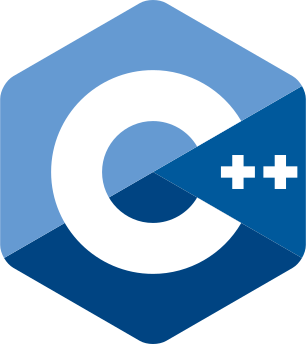

### Hi there 👋 I'm Mathis!
I'm <b>Mathis</b>, I'm 20, I'm French 🇫🇷. I love new technologies and development. Currently studying at Epitech Technology, I have been practicing development since 2017. I also do some freelance work. In can develop websites, applications, programs, libraries, APIs etc.  
To learn more about me, go to [my website](https://mathislebonniec.fr)!

 

You can follow me on my networks and find me on my portfolio.

---

### Technologies I use

For most of my projects, I use TypeScript, especially with `NodeJS`.  
On the server side, I mostly use mongoDB, PostgreSQL or MySQL for databases, and NestJS for APIs.
On the front side, I use NuxtJS 3.

 

	
	&nbsp;&nbsp;&nbsp;&nbsp;&nbsp;
	
	&nbsp;&nbsp;&nbsp;&nbsp;&nbsp;
  	
	&nbsp;&nbsp;&nbsp;&nbsp;&nbsp;
	
	&nbsp;&nbsp;&nbsp;&nbsp;&nbsp;
	
	&nbsp;&nbsp;&nbsp;&nbsp;&nbsp;
	
	&nbsp;&nbsp;&nbsp;&nbsp;&nbsp;
	
	&nbsp;&nbsp;&nbsp;&nbsp;&nbsp;
	
	&nbsp;&nbsp;&nbsp;&nbsp;&nbsp;
	
	&nbsp;&nbsp;&nbsp;&nbsp;&nbsp;
	
	&nbsp;&nbsp;&nbsp;&nbsp;&nbsp;
	
	&nbsp;&nbsp;&nbsp;&nbsp;&nbsp;
	
	&nbsp;&nbsp;&nbsp;&nbsp;&nbsp;
	
	&nbsp;&nbsp;&nbsp;&nbsp;&nbsp;
	

