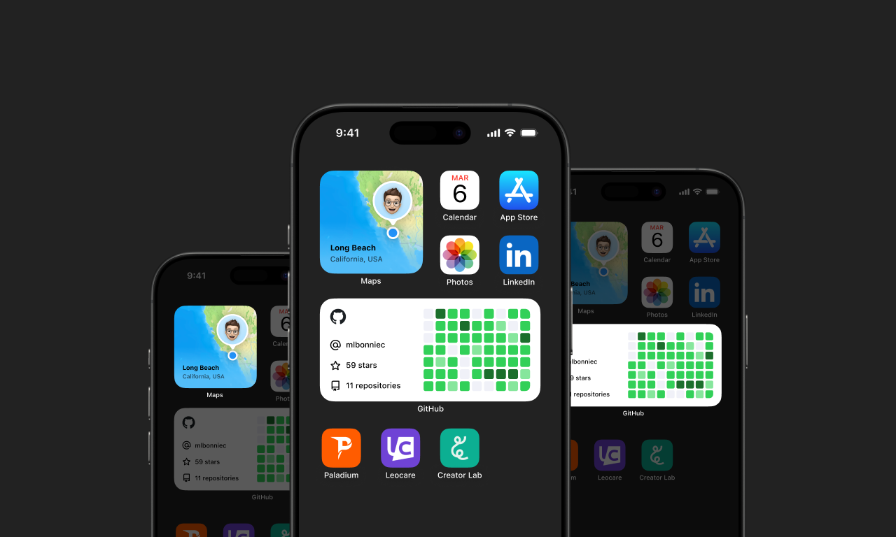

### Hi, I'm Mathis.
##### iOS Engineer at Withings

I'm an iOS Engineer from France 🇫🇷 currently working on making health data more accessible at [Withings](https://withings.com).  
I'm studying software engineering at EPITECH France, and I've had the opportunity to spend a study abroad year in Long Beach, California at CSULB.

I love building new things, being creative, working on Swift applications, libraries etc.

I've been interning as an iOS Developer at [Leocare](https://leocare.eu) and as a Web Developer at [Paladium](https://paladium-pvp.fr).

Discover more about my work and projects on my portfolio at [mathislebonniec.fr](https://mathislebonniec.fr).

#### My recent open-source projects

* [QuickActionsKit](https://github.com/mlbonniec/QuickActionsKit) - A lightweight Swift library for configuring and handling Home Screen Quick Actions with minimal setup.
* [OnBoardingKit](https://github.com/mlbonniec/OnBoardingKit) - Apple OnBoarding views Swift Package with a TipKit like architecture.
* [AnimatedNavigationTitle](https://github.com/mlbonniec/AnimatedNavigationTitle) - A SwiftUI package that helps you to recreate X, Github and Reddit animated navigation title scrolling effect.

#### Get in touch
* [Portfolio](https://mathislebonniec.fr)
* [LinkedIn](https://www.linkedin.com/in/mathis-le-bonniec)
* [GitHub](https://github.com/mlbonniec)
